# KẾ HOẠCH TRIỂN KHAI: FRONTEND AUTH INTEGRATION & ROUTE GUARDS

- **Dự án:** ClaimTrace — Academic Research Provenance & Evidence Audit Platform
- **Mã kế hoạch:** PLAN-AUTH-2026-0929
- **Người lập:** `orchestrator`
- **Mục tiêu:** Tích hợp giao diện Frontend với Backend Authentication REST APIs (`/api/auth/register`, `/api/auth/login`, `/api/auth/me`, `/api/auth/logout`), quản lý JWT Token, thiết lập HTTP Interceptor, bảo vệ tuyến đường (Route Guards) và phân quyền điều hướng theo Role (RBAC).

---

## 1. Cấu Trúc Phân Rã Công Việc (Work Breakdown Structure - WBS)

```mermaid
flowchart TD
    WBS[Tích Hợp Xác Thực & Phân Quyền Route]
    
    WBS --> S1[Stage 1: Orchestrator]
    S1 --> S1_1[Lập kế hoạch WBS & Thiết lập Quality Gates]
    
    WBS --> S2[Stage 2: Requirements Analyst]
    S2 --> S2_1[Bóc tách User Stories AUTH-01, AUTH-02, AUTH-03]
    S2 --> S2_2[Thiết kế Auth Data Contracts & TypeScript DTOs]
    S2 --> S2_3[Xác lập Acceptance Criteria Gherkin AC-A01..AC-A05]
    
    WBS --> S3[Stage 3: Backend Engineer Client Service]
    S3 --> S3_1[Đối soát Spring Boot DTOs AuthResponse, UserResponse]
    S3 --> S3_2[Xây dựng apiClient.ts kèm Bearer Interceptor & 401 Handler]
    S3 --> S3_3[Xây dựng authService.ts login, register, me, logout]
    
    WBS --> S4[Stage 4: Frontend Engineer UI & Guards]
    S4 --> S4_1[Dựng AuthContext & useAuth Hook quản lý token & session]
    S4 --> S4_2[Nâng cấp LoginPage hỗ trợ Sign In, Sign Up, Error Alert, Spinner]
    S4 --> S4_3[Xây dựng ProtectedRoute & RoleRoute kiểm tra quyền truy cập]
    S4 --> S4_4[Xây dựng ForbiddenPage 403 Access Denied]
    S4 --> S4_5[Cập nhật Header hiển thị Profile, Role badge & Nút Logout]
    S4 --> S4_6[Cấu hình phân luồng điều hướng theo Role sau đăng nhập]
    
    WBS --> S5[Stage 5: QA Test Engineer]
    S5 --> S5_1[Chạy npx tsc -b kiểm tra Type strict]
    S5 --> S5_2[Chạy npm run lint oxlint kiểm tra linter]
    S5 --> S5_3[Chạy npm run build kiểm tra production bundling]
    S5 --> S5_4[Nghiệm thu toàn bộ 5 tiêu chí Acceptance Criteria]
    S5 --> S5_5[Lập Báo cáo kiểm thử & Giấy chứng nhận chất lượng]
```

---

## 2. Các Cổng Kiểm Soát Chất Lượng (Quality Gates)

| Cổng | Vai trò | Điều kiện Tiên quyết (Exit Criteria) |
| :--- | :--- | :--- |
| **Gate 1** | `requirements_analyst` | Hoàn thành `AUTH_SPEC.md`, `AUTH_DATA_CONTRACTS.ts`, `AUTH_ACCEPTANCE_CRITERIA.md`. |
| **Gate 2** | `backend_engineer` | `apiClient.ts` và `authService.ts` đồng bộ 100% với Spring Boot DTOs, hỗ trợ Bearer header và fallback an toàn. |
| **Gate 3** | `frontend_engineer` | `AuthContext`, `LoginPage` (Login/Register), `ProtectedRoute`, `ForbiddenPage` hoàn tất, Strict Light Mode. |
| **Gate 4** | `qa_test_engineer` | `npx tsc -b` = 0 lỗi; `npm run lint` = 0 lỗi/cảnh báo; `npm run build` = thành công. |
| **Gate 5** | `orchestrator` | Toàn bộ 5 tiêu chí nghiệm thu đạt chuẩn; cấp chứng nhận bàn giao. |
